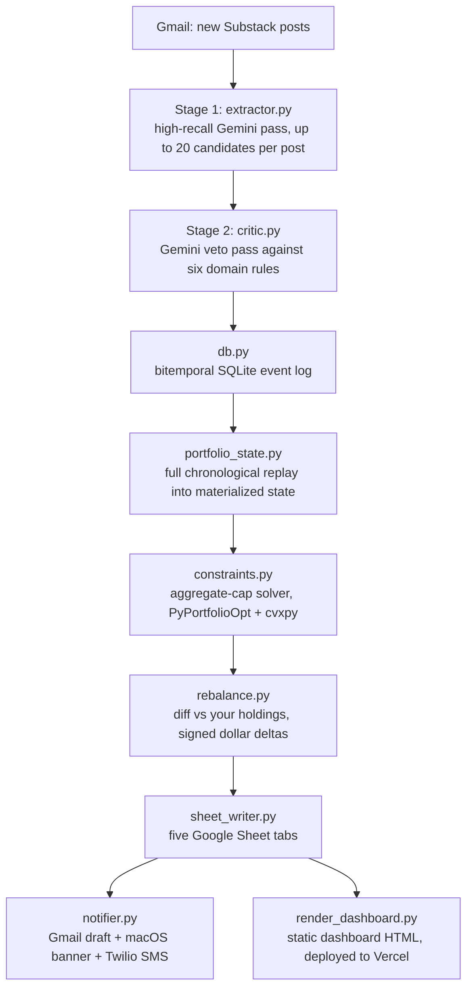

# Burry Tracker

A scheduled pipeline that reconstructs Michael Burry's disclosed investment portfolio from his Substack posts. It reads each new post from Gmail, runs a two-stage LLM extraction to turn prose into typed trade signals, replays the full signal history into a materialized portfolio model, solves his stated allocation caps as a convex optimization problem, diffs the result against your own holdings, and publishes everything to Google Sheets, a static web dashboard, and three notification channels. Every number in the output traces back to a quoted sentence in a dated post.

**Live dashboard:** https://burry-tracker-three.vercel.app

## Why this is interesting

Burry posts trade disclosures and commentary to a paid Substack. The signal is real but messy: a single post might confirm a past purchase, hint at a position size, lay out a hypothetical, or walk back something said last week. This system reads every post and turns that prose into a structured, auditable model of what he actually holds. It then compares that model to your portfolio so you can see the gap in signed dollar terms.

Each run answers three questions:

1. **What did Burry disclose?** New posts are pulled from Gmail and run through a two-stage LLM extractor that produces typed, confirmed trade signals.
2. **What does he hold now?** The full history of signals is replayed chronologically to materialize a current portfolio state, then constrained to respect his stated aggregate caps (for example, "puts under 5%").
3. **What should I do about it?** The constrained target is diffed against your own holdings to produce signed dollar rebalance deltas.

## Architecture



Two design choices are worth calling out:

- **Two-stage extraction.** A single high-recall pass over-extracts: it treats a re-confirmation as a new buy, or a hypothetical as a real position. The critic stage exists to catch exactly those failure modes ("I continue to own X" is a holding statement rather than a fresh purchase; "I rolled my puts" must produce a paired closure and execution). Keeping recall and precision in separate prompts proved more reliable than asking one prompt to do both.
- **Full replay on every cycle.** Portfolio state is recomputed from the complete signal log each run instead of being incrementally updated. This makes the system auditable ("what did we believe on date X?") and self-correcting: fixing a bad signal in the log fixes all downstream state on the next run.

## Data model

### Bitemporal signal log

Every signal carries two timestamps:

- `valid_time` records when Burry actually acted, taken from the post content.
- `transaction_time` records when the system ingested the signal.

This separation lets you reconstruct both the true timeline of his trades and the system's knowledge timeline, and tell the two apart when a post discloses something weeks after the fact.

### Signal taxonomy

`signals.py` defines a typed discriminated union of ten signal classes. The extractor and critic classify each disclosure into exactly one:

| Type | Meaning |
|------|---------|
| `EXECUTION` | A confirmed past trade (buy or sell; stock, call, or put) |
| `POSITION_DISCLOSURE` | A holding statement, with an optional weight hint |
| `ALLOCATION_TARGET` | A stated target weight for a position |
| `AGGREGATE_CAP` | A ceiling across a category (for example, "puts under 5%") |
| `HOLD_CONFIRM` | Confirmation that an existing position is unchanged |
| `FUTURE_PLAN` | An intention that has not yet been acted on |
| `CONDITIONAL` | An action that depends on a stated condition |
| `CLOSURE` | A position fully exited |
| `HYPOTHETICAL` | A thought experiment, explicitly disclaimed as unreal |
| `WATCHLIST` | Something he is watching without holding |

Replay filters out `FUTURE_PLAN` and `CONDITIONAL` before walking the log, so unrealized intentions never inflate the modeled portfolio. Positions with undisclosed weights stay honestly unknown; the system never fabricates a number the posts did not state.

### Outputs

Five synchronized Google Sheet tabs (`SignalLog`, `BurryPortfolio`, `AggregateConstraints`, `Rebalance`, `AuditTrail`), a static dashboard, and a three-channel notification (Gmail draft, macOS banner, Twilio SMS) that fires only when rebalance actions survive the dollar threshold.

## Tech stack

- **Python 3.10+** with Pydantic models throughout
- **Gemini** (structured JSON output, temperature 0) for both extraction stages
- **Gmail API + Google Sheets API** (OAuth desktop flow, refresh-token headless mode for the daemon)
- **SQLite** bitemporal event log
- **PyPortfolioOpt + cvxpy** for the aggregate-cap constraint solver
- **Jinja2 + Chart.js** for the static dashboard
- **Vercel** for hosting; **launchd** for scheduling on macOS; **Twilio** for SMS

## Setup

Order matters. Each step depends on the previous one.

```bash
# 0. Create and activate a virtualenv, then install dependencies.
python3 -m venv .venv
source .venv/bin/activate
pip install -r requirements.txt

# 1. Copy the env template and fill in your values.
cp .env.example .env

# 2. Authenticate. Opens a browser for Google OAuth consent and writes
#    ~/.substack-trader/token.json. CLI-only; never run from a daemon.
python -m substack_trader auth

# 3. Create the five Google Sheet tabs.
python -m substack_trader bootstrap

# 4. (Optional) Seed history from the last public 13F filing plus a
#    Substack archive scrape or a local corpus.
python -m substack_trader backfill --dry-run   # preview
python -m substack_trader backfill             # commit

# 5. Run one cycle by hand to confirm every credential works.
python -m substack_trader run

# 6. Install the scheduled service (macOS launchd; 8am, 1pm, 6pm ET weekdays).
python -m substack_trader install-service
```

### Configuration

All configuration lives in `.env` (see `.env.example`):

| Variable | Purpose |
|----------|---------|
| `BURRY_TRACKER` | Google Sheet ID that receives the five tabs |
| `SUBSTACK_GMAIL_LABEL` / `SUBSTACK_GMAIL_SENDER` | Which Gmail label and sender to poll |
| `GEMINI_API_KEY` | Gemini API key for both extraction stages |
| `GOOGLE_OAUTH_CLIENT_ID` / `GOOGLE_OAUTH_CLIENT_SECRET` | OAuth desktop-app client (or drop `client_secrets.json` into `~/.substack-trader/`) |
| `RISK_MULTIPLIER`, `MIN_REBALANCE_USD`, `USER_PORTFOLIO_CSV_PATH` | Rebalance engine tuning |
| `TWILIO_*` | Optional SMS alerts |

Your holdings CSV uses four columns (`ticker,instrument_type,quantity,current_value_usd`); see `dashboard/sample_user_portfolio.csv`. Without it, the rebalance tab stays empty and everything else still runs.

## The dashboard

The deployed site is a static snapshot: its data is baked into `dashboard/index.html` at render time by `render_dashboard.py`, which reads a fresh SQLite snapshot through `dashboard_data.py` and inlines it into the Jinja template at `templates/burry_tracker.html.j2`. The generated `index.html` is deliberately excluded from this repository because it embeds real extracted data. Rendering is failure-isolated: if a render fails, the cycle still completes and you get an alert, so a dashboard bug can never block the money-moving logic.

Refresh and redeploy the live site with:

```bash
scripts/redeploy_burry_tracker.sh
```

## CLI reference

| Command | What it does |
|---------|-------------|
| `python -m substack_trader run` | Run one full cycle (this is what launchd fires). Prints a JSON result. |
| `python -m substack_trader auth` | Interactive OAuth bootstrap. Writes the token file. |
| `python -m substack_trader bootstrap` | Create the five Sheet tabs. |
| `python -m substack_trader extract --message-id ID` | Debug: run both stages on one Gmail message. |
| `python -m substack_trader extract --file PATH` | Debug: run both stages on a local post file. |
| `python -m substack_trader backfill [--dry-run] [--use-local]` | One-time historical seed. `--use-local` reads cached bodies from `data/raw/`. |
| `python -m substack_trader test-notify` | Fire a sample notification across all three channels. |
| `python -m substack_trader install-service` / `uninstall-service` / `status` | Manage the launchd schedule. |

## Engineering notes

- **OAuth separation is a hard constraint.** The interactive consent flow may only run from the CLI. Every daemon-reachable path uses a refresh-only headless loader that raises on missing tokens, because a browser spawn from launchd hangs forever with no GUI session to host it.
- **Cycles are idempotent.** Posts dedupe by URL against the event log, Sheet appends pass a dedup key, and the Gmail cursor is a forward-only single message ID. Re-running a cycle against the same inputs makes no new writes, and a backfill and a live run over the same posts converge on the same final state.
- **The schedule uses `StartCalendarInterval` on purpose.** A `KeepAlive` daemon would restart a slow run mid-cycle; discrete calendar fires (fifteen entries: three hours across five weekdays) cannot.
- **Notifications tolerate partial failure.** The three channels fire in parallel threads; any one can fail without blocking the others, and a token-refresh failure sends an SMS so the system fails loudly.
- **Backfill has two tracks.** Track A seeds the last public 13F filing as position disclosures. Track B walks the public Substack archive (through a headless-browser CLI configured via `BROWSE_BIN`, or a local corpus in `data/raw/`) and runs the same two-stage extractor, so historical and live posts flow through identical code.

## Testing

```bash
python -m pytest tests/
```

Covers OCC option-symbol generation, Robinhood deep links, and the dashboard snapshot builder.

## License

MIT. See [LICENSE](LICENSE).
